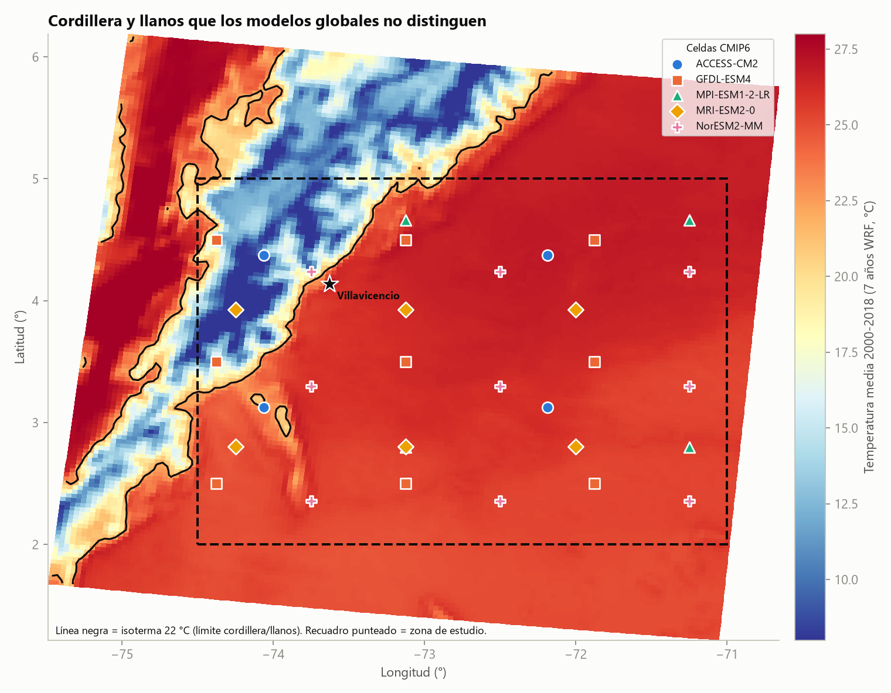

# Proyecciones climáticas del Meta (Colombia): CMIP6, observaciones, ENSO y WRF

Ensamble de 5 modelos CMIP6 para la temperatura y la precipitación del departamento del Meta (recuadro lat 2-5 N, lon -74,5 a -71 W),
comparado con observaciones (ERA5, CHIRPS, IDEAM), con el ENSO (ONI) y con simulaciones WRF de 4 km que separan cordillera y llanos.

> **English summary.** A 5-model CMIP6 ensemble (SSP1-2.6, SSP2-4.5, SSP5-8.5) for temperature and precipitation over the Meta department (Colombia),
> evaluated against ERA5, CHIRPS and IDEAM stations, ENSO (ONI) and 4-km WRF runs. Main message: global models (~100-200 km) cannot tell the Andean
> foothills from the Llanos; a WRF-based spatial offset gives zone-level projections. Temperature change is robust across models; precipitation change is not.



*Fondo: temperatura media (WRF, 4 km). Línea negra: isoterma de 22 °C (límite cordillera/llanos). Símbolos: centros de celda de cada modelo CMIP6.*

## Resultados principales

| | SSP1-2.6 | SSP2-4.5 | SSP5-8.5 |
|---|---|---|---|
| Δ temperatura 2081-2100 vs 1995-2014 (ensamble) | +1,1 °C | +2,1 °C | +4,6 °C |
| Δ precipitación anual 2081-2100 (ensamble) | +2,1 % | +0,4 % | -7,7 % |

- **Temperatura: señal robusta.** Los 5 modelos coinciden en el signo y en el orden de los escenarios.
- **Precipitación: señal incierta.** Ningún cambio medio supera la dispersión entre modelos; los modelos subestiman la lluvia ~20 % frente a ERA5 y las
  observaciones difieren entre sí hasta ~16 %. Debe leerse como "tendencia a disminuir con alta incertidumbre" en SSP5-8.5, no como un cambio confirmado.
- **Cordillera y llanos** (WRF, celdas con media anual < 22 °C = cordillera, 13 % del recuadro): en SSP5-8.5 a 2081-2100 la cordillera pasaría de ~12,4 a ~16,9 °C
  y los llanos de ~25,4 a ~30,0 °C. **Supuesto:** calentamiento uniforme; el WRF aporta solo el contraste espacial.
- **ENSO:** ~+0,25 °C por cada 1 °C de ONI (rezago de 3 meses). Un El Niño fuerte suma ~+0,4 °C, comparable a la mitad del calentamiento a corto plazo
  pero pequeño frente al de fin de siglo en SSP5-8.5.

## Estructura

```
scripts/        código (descarga, análisis, figuras, WRF, ENSO, Excel)
resultados/
  figuras/      27 gráficas PNG
  tablas/       20 CSV con los resultados numéricos
  excel/        Proyecciones_Meta_CMIP6.xlsx (17 hojas con tablas, fórmulas y gráficos)
observaciones/  promedios regionales mensuales derivados (ERA5, CHIRPS, IDEAM) y ONI
```
No se incluyen los datos pesados (NetCDF de CMIP6 y WRF): se descargan o regeneran con los scripts.

## Cómo reproducirlo

Requisitos: Python 3.10+ y `pip install -r requirements.txt`.

1. **Descarga CMIP6** (Copernicus CDS): crea tu cuenta, acepta la licencia del dataset `projections-cmip6` y guarda tu token en `~/.cdsapirc`
   (`url: https://cds.climate.copernicus.eu/api` y `key: <tu token>`). **Nunca subas ese archivo.**
   `python scripts/descargar_cmip6.py` → `datos_crudos/cmip6_zip/` (40 zip: 5 modelos x 4 experimentos x 2 variables).
2. `python scripts/descomprimir_nc.py` → `datos/nc/` (o define `CMIP6_NC_DIR` con otra carpeta; en Windows evita rutas con tildes).
3. `python scripts/analisis_anomalias.py`, `graficas_png.py`, `comparacion_observaciones.py`, `proyeccion_corregida.py` → tablas y figuras en `resultados/`.
4. **Opcional, WRF y ENSO:** `wrf_procesar.py` necesita NetCDF horarios de temperatura del WRF recortados al Meta (derivados del dataset NCAR RDA d616000;
   el script de recorte no está incluido). Define `WRF_NC_DIR` y luego ejecuta `enso_wrf.py`.
5. `python scripts/informe_excel.py` genera el Excel. Ábrelo y guárdalo en Excel/LibreOffice para que las fórmulas guarden sus valores calculados.

## Métodos, en breve

- **Línea base:** Historical 1995-2014 por modelo. **Plazos:** 2021-2040, 2041-2060, 2081-2100 (ventanas de 20 años).
- **Ajuste con observaciones (factor de cambio):** temperatura = ERA5 + cambio mensual del modelo; precipitación = ERA5 x factor trimestral móvil del modelo,
  renormalizado para que el total anual cambie lo mismo que en el modelo. El factor puramente mensual inflaba el cambio anual de lluvia 2-6 puntos
  (meses secos con base casi nula) y se descartó; queda como análisis de sensibilidad (`resultados/tablas/proyeccion_ajustada_sensibilidad_precipitacion.csv`).
- **ENSO:** regresión mensual 1995-2025 de la anomalía sobre tendencia + ONI con rezago, con errores Newey-West.

## Limitaciones

Un solo miembro por modelo y solo 5 modelos; mallas de ~100-200 km; ajuste de tipo delta (no corrección de sesgo completa); IDEAM aporta solo Tmax/Tmin
(temperatura media aproximada); el WRF son 7 años de temperatura (no una proyección futura); el calentamiento por zona se supone uniforme; el ENSO futuro no se evalúa.

## Datos y créditos (verifica cada licencia antes de reutilizar)

- **CMIP6 y ERA5:** Copernicus Climate Change Service (C3S) / Climate Data Store. *Generated using Copernicus Climate Change Service information.*
  Ni la Comisión Europea ni ECMWF son responsables del uso de esta información.
- **Modelos:** NorESM2-MM, MRI-ESM2-0, MPI-ESM1-2-LR, GFDL-ESM4 y ACCESS-CM2 (miembro r1i1p1f1).
- **CHIRPS v2.0:** Climate Hazards Center, UC Santa Barbara. **IDEAM:** estaciones del Instituto de Hidrología, Meteorología y Estudios Ambientales de Colombia, obtenidas de su plataforma de datos abiertos DHIME.
- **ONI:** NOAA. **WRF:** simulaciones del NCAR Research Data Archive (dataset d616000).
- Los CSV de `observaciones/` son promedios regionales mensuales derivados de esas fuentes. Los del IDEAM son promedios entre estaciones calculados por el autor a partir de datos abiertos de DHIME (no son las series originales).

## Licencia

Código bajo licencia MIT (ver `LICENSE`). Figuras y tablas: se sugiere CC BY 4.0, a confirmar por el autor.
